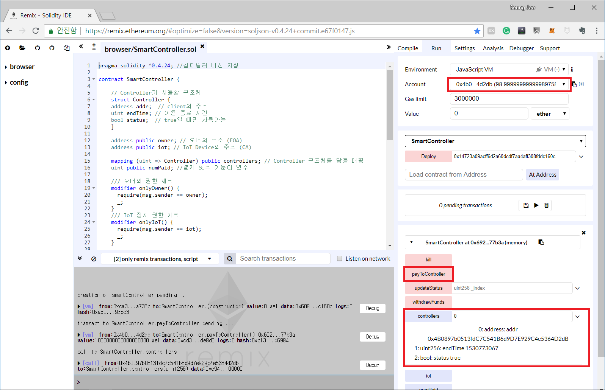

# 2장
### 스마트 컨트랙트 배포

---

이제 코드에 대한 분석이 끝났으니 스마트 컨트랙트를 배포 해 보겠다.

스마트 컨트랙트의 소스 코드를 작성을 했으면 컴파일을 해야한다.

이를 위해 리믹스를 사용할 것이다.
리믹스는 브라우저 용 솔리디티 통합 개발환경이다.
리믹스를 통해 스마트 컨트랙트를 배포할 수 있고 각종 디버깅 도구 등 여러가지 기능을 제공해준다.

미스트라는 이더리움 지갑으로도 쓰이며 지갑을 연동해서 이더리움 기반 앱 및 컨트랙트를 배포할 수 있는
도구도 있지만 이를 위해서는 각종 커맨드 라인을 입력해서 설치하고 geth과 연결을 하는 등의 작업이 필요하다.

하여 우리는 조금 더 간단한 리믹스 도구를 이용해 스마트 컨트랙트를 컴파일하고 배포할 것이다.

[리믹스](https://remix.ethereum.org/)를 들어가면 예시로 작성되어 있는 투표관련 소스 코드가 있을 것이다.

이를 전부 지운다.
그리고 우리가 앞에서 분석했던 소스 코드 전체를 복사해서 붙여넣는다.
>만약 예시 코드를 남겨두고 싶다면, 리믹스 페이지 왼쪽 위에 + 버튼을 눌러 새로운 파일을 만들고 그곳에 작성을 해도 된다.

>**주의:** 만약 리믹스를 켰는데 오른쪽 하단에 https 관련하여 팝업 경고창이 떴었다면 주소창가서 https를 http로 변경해 재접속을 하면 된다.
리믹스에서는 http를 사용하는 것을 권장한다. 만약 경고문이 뜨지 않았다면 계속 사용해도 된다.

그리고 리믹스 화면 오른쪽 위 Settings에 들어가 **select new compile version** 으로 컴파일 버전을 변경해준다.
필자는 0.4.24+commit.e67f0147 버전을 사용하도록 했다.

>솔리디티는 계속해서 발전하는 중이고, 그에 따라 추가 또는 제거되는 문법들이 생겨난다.
이로인해 코드의 문법이 컴파일 버전에 맞지 않으면 컴파일이 되지 않는 경우도 발생할 수 있다.

그리고 다시 Compile을 눌러 처음 화면으로 돌아와 위에 **Start to compile** 버튼을 누른다.
그럼 시간이 조금 지나면 아래에 몇개의 주의 메세지가 노란색 박스로 표시가 되고 잘 컴파일이 되었다면
우리가 작성한 SmartController에 대한 초록색 박스가 생길 것이다.

이제 컴파일이 완성이 되었으니 먼저 코드를 테스트 해보겠다.

이를 위해 화면 우측에 있는 **Run** 을 들어가 Environment에서 Java Script VM을 선택해 보겠다.
이 환경을 사용하면 임시 계정 5개와 각각의 계정에 100 이더씩 있는 환경을 조성해 줘서 우리가 만든 컨트랙트를
테스트 할 수 있는 환경을 만들어 준다.

각각의 계정에 대한 정보는 Account를 보면 알 수 있다.
Account에 나와있는 주소 옆에 있는 클립 보드 아이콘을 클릭하면 해당 계정의 주소를 복사할 수 있으니 참조하길 바란다.

그럼 이제 SmartController 아래 빨간 상자의 deploy를 눌러 배포를 할 것인데, 그 전에 우리 코드의 생성자를 살펴보자.

~~~
///생성자, IoT장치의 주소를 매개변수로 받음
constructor (address _iot) public { // 접근지정자 꼭!
      // owner의 값에 이 계약을 생성한 계정 주소 대입
  owner = msg.sender;
  iot = _iot;
  numPaid = 0;
}
~~~

보는 것처럼 생성을 할 때, 이 컨트랙트에 사용될 IoT 기기의 주소가 들어간다.
앞 장에서 말한 것처럼 이 컨트랙트에 주체는 3가지가 있다.

1. 컨트랙트 배포한 사람 - owner
2. IoT 기기 - iot
3. IoT 기기를 빌리는 클라이언트 - clinet

우리는 각각의 owner, iot, client를 우리가 가지고 있는 Account의 1번, 2번, 3번의 주소로 역할을 할당해 줄 것이다.

그럼 먼저 Account에서 2번째로 있는 계정의 주소를 옆에 클립보드 아이콘을 눌러 복사를 한다.
그리고 아래 빨간 박스 deploy 옆에 iot_address에 붙여 넣는다.

그리고 이제 컨트랙트를 배포를 할 때는 owner가 배포를 해야하니, 다시 Account에서 1번째 계정을 선택하고 deploy 버튼을 누르자.

만약 성공적으로 계정 1번이 스마트 컨트랙트를 배포를 했다면 위와 같은 사진이 나올 것이다.

여기서 살펴볼 것이 2가지가 있다.

1. 먼저 컨트랙트를 배포한 계정의 이더가 원래 가지고 있던 100이더에서 99.999..의 이더로 줄어들었다는 것과
2. 아래에 코드에 있는 각종 함수들이 나와있고 어떤 함수들은 빨간색으로, 어떤 함수는 파란색으로 나와있는 것을 볼 수 있을 것이다.

solidity에는 가스(Gas)라는 개념이 있다. 이는 스마트 컨트랙트를 배포하거나, 컨트랙트 안의 상태 값들을 변경하는 함수를 호출할 때 지불하는 비용이다.

이 가스비는 한번 실행시키는데 최대 가스비가 제약이 되어있고, 커맨드를 하나 실행 시킬 때 마다 측정이 된다.
즉, 이러한 제약 덕분에 무한 루프를 실행시켜 공격을 받아도, 가스비가 다 달아서 실행시킬 수 없게 할 수 있다.
또한 함수를 호출하는 트랜잭션을 처리해 주는 마이너들에게 수수료로 지불하는 목적으로 사용이 된다.

여기서 빨간색은 가스비를 지불해야 하는 함수들을 나타내고, 파란색은 상태를 읽어오기만 하는, 가스비가 나가지 않는 함수들을 의미한다.

그럼 이 함수들을 간단히 정리해 보자.

먼저 빨간색 함수들이다.
- kill: **컨트랙트를 배포한 사람** 이 이 컨트랙트를 죽이는 함수
- payToController: **클라이언트** 가 IoT 기기를 빌리기 위해 1 이더를 지불할 때 호출하는 함수
- updateStatus: **IoT 기기** 가 사용시간이 끝난 클라이언트의 빌림 상태를 false로 만들때 호출하는 함수
- withdrawFunds: **컨트랙트를 배포한 사람** 이 이 컨트랙트에 묶여있는 돈을 인출할 때 호출하는 함수

다음은 파란색 함수들이다.
- controllers: IoT 기기를 빌리기 위해 돈을 지불한 클라이언트들의 상태를 확인할 수 있다. 클라이언트는 인덱스 번호로 구분된다.
- IoT: 컨트랙트와 연결되어있는 IoT 기기의 주소를 확인하는 함수
- numPaid: 지금까지 몇명의 클라이언트가 IoT 기기를 빌렸는지 확인하는 카운터이자
           새로운 클라이언트가 돈을 지불할 시 controllers에 들어가게 될 인덱스 번호
- owner: 컨트랙트 owner의 주소

그럼 먼저 파란색 함수들부터 실행을 해보자.
- controllers 함수에 인덱스 번호 0을 넣고 파란 버튼을 클릭해 보자. 그러면 아직까지 클라이언트가 IoT 기기를 이용한 적이 없기 때문에 클라이언트 주소도 없고 상태도 false로 되어 있을 것이다.
- IoT를 눌러보면 우리가 등록한 2번째 계정의 주소를 반환할 것이다.
- numPaid를 눌러보면 아직까지 빌린 클라이언트가 없기 때문에 0을 반환한다.
- owner를 눌러보면 우리가 계정 1번으로 이 컨트랙트를 배포했기 때문에 계정 1번의 주소를 반환할 것이다.

그럼 이제 클라이언트가 IoT 기기를 빌리기 위해 컨트랙트에 돈을 내는 상황을 진행해 보겠다.

먼저 Account에서 3번째 계정을 선택하고 Account 밑에 value 부분에 단위는 ether로 설정을 하고 보내는 값은 1로 설정을 하자.
그리고 나서 payToController 를 클릭해보자.

그러면 3번 계정에서 이더가 줄어든 것을 알 수 있을 것이다.
그리고 controllers에 0 값을 넣어 0번째 클라이언트의 상태를 확인해 보면 3번 계정의 주소, 대여 종료시간 그리고 대여 상태가 true로 되어있는 것을 알 수 있을 것이다.

원한다면 4번 5번 계정으로 똑같이 payToController를 통해 이더를 지불하고 controllers의 인덱스 번호를 확인해 봐도 좋다.

그럼 이제 클라이언트가 IoT 기기를 빌린 상황까지 온 것이다.

그럼 이제 클라이언트의 종료시간이 지나서 IoT 빌림 상태를 false로 만드는 updateStatus 함수를 진행해 보자.

참고로 앞에서도 말했듯이 now의 시간은 블록의 timeStamp이기 때문에 블록이 계속 생성이 되어야 now의 timeStamp 값도 증가가 될 것이다. 그러나 지금 환경에서는 바로 종료 함수를 실행시키는 것이 가능하다.

그럼 이제 IoT 계정인 2번째 계정을 선택하고
0번째 클라이언트의 IoT 빌림 상태를 false로 만들기 위해 updateStatus 함수에 0 값을 넣고 호출을 해보자.

성공적으로 처리가 되었다면 이제 controllers를 통해 0번째 클라이언트 상태를 알아보자.
controllers에 0의 값을 넣고 호출을 해보자.

그러면 아무것도 안넣었을 때와는 다르게 클라이언트의 주소와 대여 종료시간은 표시가 되어있지만 빌림 상태는 false로 바뀌어 있는 것을 알 수 있다.

그럼 이제 클라이언트이 IoT 대여가 종료가 된 것이다.

이제 마지막으로 클라이언트들이 이 컨트랙트에 지불한 돈을 owner로서 인출해 보겠다.
Account에서 1번 계정을 선택하고 withdrawFunds를 선택해보자.

그러면 계정 1번의 이더가 증가한 것을 볼 수 있을 것이다.

 

여기까지가 우리가 작성한 스마트 컨트랙트의 모든 상호작용의 끝이다.
이제 다음 장에서 이 스마트 컨트랙트를 메타마스크와 랍스텐 테스트 환경에서 실험해 보겠다.
